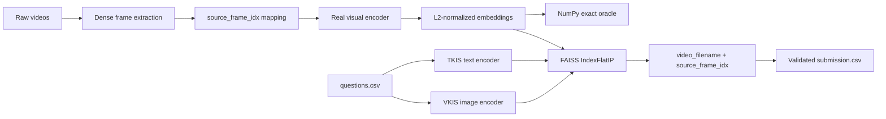

# SkillPixel TKIS/VKIS Implementation Report

Ngày cập nhật: 2026-08-06
Repository: `D:\Code\Code\AIO\Code\HCMAIC`
Working directory Git: `D:\Code\Code\AIO\Code\HCMAIC\system`
Branch: `feat/skillpixel-tkis-vkis`
HEAD sau phase P0-G: `c875d43`

## 1. Tóm tắt kết quả

Đã implement và smoke test pipeline SkillPixel TKIS/VKIS theo hướng raw-video-first:



Kết quả trên `DataMockTest`:

- 250 raw videos được xử lý độc lập với BTC-provided keyframes, mapping và features.
- 9.835 sampled frames được lưu và embed.
- Sampling mặc định: dense stride 10; hỗ trợ stride 12.
- Provider thực sự chạy: CLIP `openai/clip-vit-base-patch32`, 512 dimensions, CPU.
- SigLIP2 `google/siglip2-base-patch16-224` được thử trước ở chế độ local-only; vì máy chưa có cache nên fallback sang CLIP thật.
- FAISS `IndexFlatIP` load lại thành công với `ntotal=9835`, `dimension=512`.
- NumPy exact oracle và FAISS top-100 có kết quả khớp trong smoke test.
- 50 TKIS queries và 50 VKIS queries đều chạy được; mỗi query có 100 answers.
- `submission.csv` hợp lệ: 100 queries, mỗi query đúng 100 answers, filename và `source_frame_idx` đều được validate.

Không dùng mock provider, BTC artifacts, OCR, ASR, object detection, TRAKE, VLM hoặc reranker trong P0 production runtime.

## 2. Input và nguyên tắc dữ liệu

Input dùng cho smoke test:

```text
learn/skillpixel/Buoi_08_Mock_contest_KIS/DataMockTest/videos/
learn/skillpixel/Buoi_08_Mock_contest_KIS/DataMockTest/questions.csv
learn/skillpixel/Buoi_08_Mock_contest_KIS/DataMockTest/corpus.csv
```

Audit ban đầu xác nhận:

- `videos/`: 250 raw `.mp4` files.
- `questions.csv`: 100 queries, gồm 50 `TKIS` và 50 `VKIS`.
- `corpus.csv`: 250 videos, có `video`, `path`, `duration_seconds`, `fps`, `frame_count`, `width`, `height`.
- VKIS query images tồn tại và có thể resolve tương đối từ thư mục chứa `questions.csv`.

Raw video là source of truth. Runtime không đọc BTC keyframe directory, BTC mapping, BTC CLIP features hoặc BTC object files để tạo submission.

## 3. Những gì đã implement theo phase

### P0-A — Raw ingestion và source-frame mapping

Commits:

- Test contract: `ac1bd97 test(skillpixel): add raw ingestion mapping contract`
- Implementation: `cf5cad6 feat(skillpixel): add raw video frame extraction and mapping`

Files chính:

- `src/hcmaic/skillpixel/raw.py`
- `src/hcmaic/skillpixel/__init__.py`
- `src/hcmaic/ingestion/mapping.py`
- `src/hcmaic/ingestion/catalog.py`
- `src/hcmaic/contracts/models.py`
- `tests/test_skillpixel_raw.py`

Đặc điểm:

- Nhận một raw video hoặc một directory raw videos.
- Decode tuần tự bằng OpenCV, không phụ thuộc BTC artifacts.
- Lưu ảnh sampled theo `n` là saved-frame ordinal, nhưng giữ `source_frame_idx` là frame index gốc trong video.
- Mapping có các trường bắt buộc:

  ```text
  n, pts_time, fps, frame_idx, source_frame_idx,
  timestamp_ms, sampling_policy
  ```

- Có thêm `video_filename`, `frame_count`, `image_path` để validate downstream.
- Manifest ghi hash raw video, sampling policy, số video/frame và hash các generated files.
- Có validator chống duplicate mapping, missing image, out-of-range source frame và mismatch frame count.

Kết quả:

- Full raw ingestion: 250 videos, 9.835 frames.
- CLI smoke một video: 29 frames với stride 10.
- Không có FFmpeg/ffprobe trên PATH; dùng OpenCV sequential decode và CFR timestamp `frame_idx / fps`.

### P0-B — Real visual embedding provider

Commits:

- Test contract: `7fafca9 test(retrieval): add real provider fallback contract`
- Implementation: `56352ec feat(retrieval): add real visual embedding provider`

Files chính:

- `src/hcmaic/embedding/base.py`
- `src/hcmaic/embedding/clip_real.py`
- `src/hcmaic/embedding/factory.py`
- `src/hcmaic/embedding/siglip2.py`
- `tests/test_skillpixel_provider.py`

Đặc điểm:

- `embed_images` cho corpus images.
- `embed_texts` cho TKIS.
- `embed_query_image` cho VKIS.
- L2 normalize và trả về `float32`.
- Factory ưu tiên SigLIP2, sau đó fallback sang CLIP thật.
- Mặc định `local_files_only=True`, không tự download model trong test/runtime.
- Manifest ghi provider, model, revision, dimension, device, dtype, batch size và preprocessing.

Provider đã chạy thật:

```text
provider: clip
model: openai/clip-vit-base-patch32
revision: 3d74acf9a28c67741b2f4f2ea7635f0aaf6f0268
dimension: 512
device: cpu
dtype: torch.float32
normalization: l2
```

### P0-C — Exact visual index và persisted artifacts

Commits:

- Test contract: `d584183 test(index): add exact visual artifact round-trip contract`
- Implementation: `bd0e4f4 feat(index): build versioned exact visual index`

Files chính:

- `src/hcmaic/skillpixel/index.py`
- `tests/test_skillpixel_index.py`

Index gồm hai lớp:

1. NumPy exact search làm oracle.
2. FAISS `IndexFlatIP` làm production baseline.

Artifacts được persist:

```text
artifacts/skillpixel-clip-stride10-v1/catalog.jsonl
artifacts/skillpixel-clip-stride10-v1/embeddings.npy
artifacts/skillpixel-clip-stride10-v1/id_map.json
artifacts/skillpixel-clip-stride10-v1/index.faiss
artifacts/skillpixel-clip-stride10-v1/dataset_manifest.json
artifacts/skillpixel-clip-stride10-v1/index_manifest.json
```

`id_map.json` giữ mapping từ FAISS row về:

```text
faiss_row, feature_row, frame_uid, video_id,
video_filename, keyframe_id, source_frame_idx,
timestamp_ms, frame_count, image_path
```

Load lại index đã validate:

- Hash artifacts.
- Số row và embedding dimension.
- Vector norm.
- FAISS `ntotal` và dimension.
- Mapping row-to-catalog.
- Dataset hash và provider compatibility.

### P0-D — TKIS text retrieval

Commits:

- Test contract: `d5bcd1d test(skillpixel): add TKIS text retrieval contract`
- Implementation: `1d7696c feat(skillpixel): implement TKIS text retrieval`

Files chính:

- `src/hcmaic/skillpixel/retrieval.py`
- `tests/test_skillpixel_tkis.py`

Đặc điểm:

- Đọc `questions.csv`.
- Route task `TKIS` qua text encoder của provider.
- Batch text queries nhưng giữ nguyên `query_id`.
- Search cùng visual index đã build từ raw video frames.
- Kết quả trả về `video_filename`, `source_frame_idx`, `timestamp_ms`, score và metadata cần thiết.

Smoke test: 50 TKIS queries, mỗi query trả đủ top-100.

### P0-E — VKIS image retrieval

Commits:

- Test contract: `d152f07 test(skillpixel): add VKIS image retrieval contract`
- Implementation: `8de33eb feat(skillpixel): implement VKIS image retrieval`

Files chính:

- `src/hcmaic/skillpixel/retrieval.py`
- `tests/test_skillpixel_vkis.py`

Đặc điểm:

- Resolve `query_image` relative to `questions.csv`.
- Route task `VKIS` qua image encoder.
- Batch query image embeddings.
- Không gọi text encoder cho VKIS.
- Dùng cùng visual image index với TKIS.

Smoke test: 50 VKIS queries, mỗi query trả đủ top-100.

### P0-F — Submission exporter và validator

Commits:

- Test contract: `31aa1b4 test(skillpixel): add validated submission export contract`
- Implementation: `c968a28 feat(skillpixel): add validated top100 submission export`

Files chính:

- `src/hcmaic/skillpixel/submission.py`
- `tests/test_skillpixel_submission.py`

Validator kiểm tra:

- Query không thiếu, không thừa, không duplicate.
- Mỗi query có đúng 100 answers.
- Answer có `source_frame_idx`, không chấp nhận keyframe ordinal thay thế.
- `video_filename` tồn tại trong corpus.
- `source_frame_idx` nằm trong `[0, frame_count)`.
- CSV quoting và readback.
- Answer cell có format:

  ```text
  video_filename.mp4,source_frame_idx
  ```

End-to-end smoke test tạo thành công 100 queries × 100 answers.

### P0-G — Reproducible CLI và final smoke

Commits:

- Test contract: `4c629f3 test(skillpixel): add reproducible CLI command contract`
- Implementation: `c875d43 test(skillpixel): verify TKIS VKIS submission pipeline`

Files chính:

- `src/hcmaic/cli/main.py`
- `tests/test_skillpixel_cli.py`

CLI đã thêm:

```text
ingest-raw
build-skillpixel-index
retrieve-skillpixel
export-skillpixel
```

Final CLI smoke đã chạy:

- Ingest CLI trên raw video thật: 1 video, 29 frames.
- Retrieve CLI trên full FAISS index: 100 queries, top-k 100.
- Export CLI: `valid=true`, 100 query rows, 100 answers/query.

## 4. Submission và artifact cuối

Submission CLI cuối:

```text
system/artifacts/skillpixel-cli-p0g-submission.csv
```

Kết quả validation:

```text
rows: 100
headers: 101
first query: Q_0001
last query: Q_0100
answers per query: 100
valid: true
errors: []
```

Một số answer đã kiểm tra:

```text
Q_0001.answer_001 = video7345.mp4,100
Q_0100.answer_100 = video9836.mp4,200
```

Round-trip sau commit:

```text
FAISS ntotal: 9835
dimension: 512
first source_frame_idx: 0
first frame_uid: video7020:000
submission_valid: True
```

Không stage raw videos, model weights, generated embeddings hoặc FAISS artifacts vào Git.

## 5. Verification cuối

Các lệnh đã chạy trong `system/`:

```powershell
uv sync --locked --extra clip --extra faiss --extra video
uv run pytest
uv run pytest tests/test_skillpixel_cli.py
uv run ruff check src tests
uv run mypy src
```

Kết quả:

```text
201 passed, 1 warning
ruff: All checks passed!
mypy: Success: no issues found in 52 source files
CLI test: 1 passed
```

Cảnh báo duy nhất là `StarletteDeprecationWarning` liên quan `httpx` trong dependency test, không ảnh hưởng SkillPixel pipeline.

## 6. Chuỗi command reproducible

Chạy toàn bộ Git command trong `system/`, không chạy commit ở repository root:

```powershell
cd D:\Code\Code\AIO\Code\HCMAIC\system

uv run hcmaic ingest-raw `
  --input ..\learn\skillpixel\Buoi_08_Mock_contest_KIS\DataMockTest\videos `
  --output artifacts\skillpixel-raw-v1 `
  --stride-frames 10

uv run hcmaic build-skillpixel-index `
  --input artifacts\skillpixel-raw-v1 `
  --output artifacts\skillpixel-index-v1 `
  --provider siglip2 `
  --device cpu `
  --batch-size 32

uv run hcmaic retrieve-skillpixel `
  --index artifacts\skillpixel-index-v1 `
  --questions ..\learn\skillpixel\Buoi_08_Mock_contest_KIS\DataMockTest\questions.csv `
  --results artifacts\skillpixel-results.jsonl `
  --provider auto `
  --device cpu `
  --batch-size 32

uv run hcmaic export-skillpixel `
  --queries ..\learn\skillpixel\Buoi_08_Mock_contest_KIS\DataMockTest\questions.csv `
  --results artifacts\skillpixel-results.jsonl `
  --corpus ..\learn\skillpixel\Buoi_08_Mock_contest_KIS\DataMockTest\corpus.csv `
  --output artifacts\skillpixel-submission.csv
```

Mặc định các command này không download model. Nếu SigLIP2 chưa có cache, provider factory sẽ báo fallback và dùng CLIP thật đã cache.

## 7. Hạn chế và việc có thể làm tiếp

- Hiện tại provider chạy CPU; full build embedding mất nhiều thời gian hơn GPU.
- SigLIP2 chưa được benchmark vì chưa có local weights.
- OCR, ASR, object detection, TRAKE, VLM và reranker chưa nằm trong P0, đúng scope ban đầu.
- P0 đang dùng uniform dense sampling stride 10; bước tiếp theo có thể benchmark stride 12, shot-boundary sampling và query-aware selection nhưng phải giữ nguyên `source_frame_idx` contract.

## 8. HCMAIC Full KIS continuation

Ngày bắt đầu: 2026-08-06
Quality status mặc định: `UNVALIDATED_ON_HCMAIC`

### Audit baseline trước K0

- Branch giữ nguyên: `feat/skillpixel-tkis-vkis`, HEAD trước K0: `c875d43`.
- Python: `3.11.15`; Torch: `2.13.0+cpu`; CUDA: unavailable.
- FAISS, OpenCV và Transformers: available.
- FFmpeg/ffprobe: unavailable; raw ingestion dùng OpenCV CFR fallback có label timestamp source.
- Cache có CLIP `openai/clip-vit-base-patch32`; chưa có cache SigLIP2.
- Raw DataMockTest: 250 videos, 100 queries, 250 corpus rows, 630,836,625 raw bytes.
- HCMAIC qrels thật chưa được tìm thấy trong checkout; chỉ có fixture qrels nên không dùng để claim contest quality.
- Execution path cũ của API `RetrievalService.search()` là visual-only; orchestrator/fusion/OCR/object/ASR chưa được API gọi thật.
- Handoff `LUNA_FULL_KIS_END_TO_END_IMPLEMENTATION.md` mô tả rõ K0 đến K8; không có section K9/K10 riêng. K9/K10 được giữ như benchmark/ablation/rehearsal/final export gates theo mục tiêu task.

### K0 completed — contracts and harness

K0 thêm:

- `src/hcmaic/contracts/kis.py`: `Evidence`, `KISQuery`, `KISResult`, `KISChannelConfig`, `KISPipelineConfig`.
- `src/hcmaic/contracts/__init__.py`: public exports.
- `src/hcmaic/retrieval/candidates.py`: mở rộng ChannelHit/FusedCandidate với `frame_uid`, `video_filename`, `source_frame_idx` và evidence metadata, vẫn giữ backward compatibility.
- `tests/test_kis_contracts.py`: task routing, raw text preservation, source-frame envelope, deterministic ordering, production no-mock guard và config serialization.

Verification K0:

```text
uv run pytest tests/test_kis_contracts.py  -> 6 passed
uv run pytest                             -> 207 passed, 1 warning
uv run ruff check ...                     -> pass
uv run mypy ...                           -> pass
```

K0 chưa bật OCR/object/ASR hay fusion trong production runtime; các channel tiếp theo phải trả evidence thật hoặc trạng thái unavailable, tuyệt đối không sinh mock score.

### K1 completed — raw ingestion and coverage hardening

K1 mở rộng `src/hcmaic/skillpixel/raw.py` và `tests/test_skillpixel_raw.py`:

- Rerun cùng raw source, SHA-256 và stride được xử lý idempotent nếu dataset đã validate.
- Mismatch source/stride trên output cũ fail-closed và yêu cầu versioned output hoặc explicit `--force`.
- Thêm `coverage_report.json` với source-frame count, sampled-frame count, sampling ratio, gap statistics và `max_nearest_frame_error`.
- Manifest ghi tên coverage artifact và hash generated files sau khi coverage được tạo.
- Đọc mapping bằng context manager, giữ source order và `source_frame_idx` immutable.
- Chưa bật TransNetV2/hybrid shot sampling vì chưa có dependency/cache; uniform source-frame stride vẫn là baseline operational.

K1 verification:

```text
uv run pytest tests/test_skillpixel_raw.py  -> 5 passed
uv run pytest                              -> 209 passed, 1 warning
uv run ruff check raw/tests                -> pass
uv run mypy src/hcmaic/skillpixel/raw.py   -> pass
CLI smoke: video8328.mp4 -> 287 source frames, 29 sampled frames, nearest error 6
CLI rerun: same source/stride -> idempotent pass

### K2 completed — visual provider provenance, exact index loading and benchmark

K2 harden `src/hcmaic/embedding/clip_real.py`, `src/hcmaic/embedding/siglip2.py`
and `src/hcmaic/skillpixel/index.py`, đồng thời thêm:

- `src/hcmaic/benchmark/kis.py`: benchmark batched TKIS/VKIS trên cùng visual
  index, ghi provider metadata, processor/preprocess revision, exact FAISS
  metadata, latency batch/mean và metric quality chỉ khi qrels được truyền vào
  một cách tường minh.
- `src/hcmaic/benchmark/__init__.py`: public benchmark exports.
- `tests/test_kis_benchmark.py`: benchmark cả TKIS và VKIS với local deterministic
  test provider; test không-qrels giữ Recall/MRR/QueryScore là `null` và test
  qrels phải khai báo provenance.

Index loader hiện fail-closed nếu manifest không chứng minh raw-video source,
`btc_artifacts_used=false`, `provider_execution=validated-local`, provider không
phải `mock`, hoặc `id_map` không round-trip đúng `frame_uid`, `video_id`,
`video_filename`, `source_frame_idx`, timestamp và image path. Hai provider thật
ghi thêm `processor_revision` và `preprocess_hash` vào manifest.

K2 verification:

```text
uv run pytest tests/test_kis_benchmark.py tests/test_skillpixel_index.py -> 4 passed
uv run ruff check <K2 files>                                         -> pass
uv run mypy <K2 source files>                                        -> pass
uv run pytest                                                        -> 211 passed, 1 warning
```

Benchmark không tự đọc fixture/BTC qrels. Checkout hiện chưa có HCMAIC qrels
chính thức, nên quality status vẫn là `UNVALIDATED_ON_HCMAIC`; K2 chỉ cung cấp
latency/provider/index evidence, không claim Recall/MRR contest.

### K3 completed — unified TKIS/VKIS visual routing

K3 thêm vào `src/hcmaic/skillpixel/retrieval.py`:

- `search_kis(KISQuery)`: một entry point canonical cho TKIS hoặc VKIS.
- `search_kis_queries(list[KISQuery])`: gom batch theo tower, giữ nguyên
  `query_id` và thứ tự input, nhưng vẫn dùng chung visual image index.
- Chuyển `SkillPixelHit` thành `KISResult` + `Evidence`, giữ đồng thời
  `frame_uid`, `video_id`, `video_filename`, `source_frame_idx`, timestamp,
  `faiss_row`/`feature_row` chỉ trong evidence metadata.
- `answer_cell` của result chỉ dùng `video_filename,source_frame_idx`; không
  dùng `faiss_row` hay keyframe ordinal làm submission identity.

Test mới: `tests/test_kis_routing.py` xác nhận một batch mixed TKIS/VKIS gọi
đúng text/image tower, preserving order/query IDs, giới hạn top-k từng query,
và round-trip canonical evidence.

K3 verification:

```text
uv run pytest tests/test_kis_routing.py tests/test_skillpixel_tkis.py tests/test_skillpixel_vkis.py -> 7 passed
uv run ruff check src/hcmaic/skillpixel/retrieval.py tests/test_kis_routing.py                  -> pass
uv run mypy src/hcmaic/skillpixel/retrieval.py                                                  -> pass
uv run pytest                                                                                    -> 213 passed, 1 warning

### K4 completed — raw-derived OCR artifact and BM25 channel

K4 thêm `src/hcmaic/retrieval/ocr_bm25.py` và `tests/test_ocr_bm25.py`:

- `OCRRecord` giữ `frame_uid`, `video_id`, `video_filename`,
  `source_frame_idx`, timestamp, text, provider và revision.
- `ocr.jsonl` được canonicalize/hash cùng `ocr_manifest.json`; loader fail-closed
  nếu sai dataset hash, hash record, raw/BTC provenance, provider execution,
  provider/revision hoặc có duplicate frame.
- Chuẩn hóa OCR gồm lowercase/casefold, bỏ dấu tiếng Việt, token boundary,
  compact form để chịu lỗi tách khoảng trắng OCR.
- `BM25OCRChannel` hỗ trợ BM25 exact term, phrase boost và proximity boost;
  kết quả trả `ChannelHit` với source-frame mapping và evidence metadata.
- Mock OCR bị từ chối ở record, writer và loader. Không có PaddleOCR/model cache
  trong môi trường hiện tại, nên production OCR artifact chưa được sinh; channel
  runtime phải báo unavailable, không tự tải model và không sinh mock score.

K4 verification:

```text
uv run pytest tests/test_ocr_bm25.py -> 4 passed
uv run ruff check <OCR source/tests> -> pass
uv run mypy src/hcmaic/retrieval/ocr_bm25.py -> pass
uv run pytest -> 217 passed, 1 warning

### K5 completed — raw-frame object artifact and retrieval channel

K5 thêm `src/hcmaic/retrieval/object_retrieval.py` và
`tests/test_object_retrieval.py`:

- `ObjectRecord` giữ label, confidence, optional bbox và đầy đủ
  `video_filename/source_frame_idx/timestamp` mapping.
- `objects.jsonl` + `object_manifest.json` được sort/canonicalize/hash; loader
  fail-closed với BTC provenance, sai dataset hash, provider/revision, duplicate
  frame-label, non-finite confidence hoặc mock provider.
- `ObjectRetrievalChannel` xây posting list trên label đã normalize (casefold,
  bỏ dấu), tính điểm từ confidence + IDF của label, và trả `ChannelHit` có
  evidence/mapping để fusion dùng tiếp.
- Ultralytics/model weights chưa có local cache trong môi trường; chưa sinh
  object artifact production. Runtime phải báo unavailable và không tự download.

K5 verification:

```text
uv run pytest tests/test_object_retrieval.py -> 4 passed
uv run ruff check <object source/tests>     -> pass
uv run mypy src/hcmaic/retrieval/object_retrieval.py -> pass
uv run pytest                               -> 221 passed, 1 warning

### K6 completed — optional timestamped ASR with promotion gate

K6 thêm `src/hcmaic/retrieval/asr.py` và `tests/test_asr.py`:

- `ASRRecord` giữ segment start/end, anchor timestamp và source-frame mapping;
  `asr.jsonl`/`asr_manifest.json` được canonicalize/hash và fail-closed với
  BTC artifact, sai dataset hash, duplicate segment, non-finite metadata hoặc
  mock provider.
- `ASRRetrievalChannel` trả evidence timestamped theo label/token match, nhưng
  không tự quyết định bật channel.
- `decide_asr_promotion` chỉ bật ASR khi có HCMAIC qrels và paired benchmark
  chứng minh gain tối thiểu; thiếu qrels/score/gain đều giữ disabled.
- Whisper/faster-whisper và model weights chưa có cache; không sinh ASR artifact
  production, không tự tải model. Runtime status sẽ là unavailable/disabled.

K6 verification:

```text
uv run pytest tests/test_asr.py -> 3 passed
uv run ruff check <ASR source/tests> -> pass
uv run mypy src/hcmaic/retrieval/asr.py -> pass
uv run pytest -> 224 passed, 1 warning

### K7 completed — hybrid fusion, source-frame dedup, diversity and bounded rerank

K7 mở rộng `src/hcmaic/retrieval/candidates.py` và `fusion.py`, đồng thời thêm
`src/hcmaic/retrieval/kis_orchestrator.py` và
`tests/test_kis_orchestrator.py`:

- `FusedCandidate` giữ canonical source mapping, per-channel evidence và
  `rerank_score`; fusion ghi lại provider/rank/score/text/metadata của từng
  channel.
- `KISHybridOrchestrator` gọi visual TKIS/VKIS bắt buộc, OCR/object optional,
  ASR chỉ khi `asr_enabled` và promotion policy cho phép; lỗi artifact/provider
  optional được cô lập thành `unavailable_channels`.
- RRF là baseline mặc định; weighted late fusion nhận weights explicit.
- Dedup theo `(video_id, source_frame_idx)`, merge signal/evidence giữa channel,
  không dùng `faiss_row` làm identity.
- Diversity quota theo video rồi backfill deterministic; bounded reranker chỉ
  xem candidate pool hữu hạn và thêm bonus agreement/visual evidence có giải
  thích trong result.
- Canonical output luôn là `KISResult` với `Evidence`, source-frame mapping và
  quality status `UNVALIDATED_ON_HCMAIC`.

K7 verification:

```text
uv run pytest tests/test_kis_orchestrator.py tests/test_fusion.py tests/test_orchestrator.py -> 10 passed
uv run ruff check <K7 source/tests> -> pass
uv run mypy <K7 source> -> pass
uv run pytest -> 228 passed, 1 warning

### K8 completed — runtime, API/CLI and operator UI execution path

K8 thêm:

- `src/hcmaic/runtime/kis.py` và package init: load exact raw-derived index,
  matching real local provider, optional OCR/object/ASR artifacts và channel
  diagnostics; provider selection giữ local-files-only mặc định.
- `src/hcmaic/api/kis_app.py`: FastAPI app thật cho `/health`, `/system/info`,
  `/search/text`, `/search/image`, `/search/batch`, frame image/context,
  `/videos/{video_id}/timeline`, `/submit/preview`, `/feedback` và
  `/exports/kis`. Export endpoint chạy runtime search rồi gọi exporter/validator
  top-100 hiện có.
- `src/hcmaic/cli/main.py`: thêm `search-kis`, `retrieve-kis`, `export-kis`,
  `serve-kis`; không dùng mock provider và không tự download nếu không bật flag
  explicit.
- `src/hcmaic/ui/static/index.html`/`app.js`: UI nhận diện KIS runtime, route
  TKIS qua text endpoint, VKIS qua ảnh base64, render canonical frame/source
  mapping và vẫn giữ compatibility với legacy app.
- `tests/test_kis_api.py` và mở rộng `tests/test_skillpixel_cli.py`: API health,
  text/image/mixed batch, timeline/image route, invalid image payload và CLI
  parser contracts.

K8 verification:

```text
uv run pytest tests/test_kis_api.py tests/test_skillpixel_cli.py -> 3 passed
uv run ruff check <K8 source/tests> -> pass
uv run mypy <K8 source> -> pass
uv run pytest -> 230 passed, 1 warning

### K9 completed — HCMAIC KIS qrels evaluator and ablation harness

K9 thêm `src/hcmaic/evaluation/kis.py`, `tests/test_kis_evaluation.py` và CLI
`benchmark-kis`:

- `load_kis_qrels` đọc JSON/JSONL/CSV qrels, hiểu `frame_uid`,
  `relevant_frame_ids`, answer cell `video_filename,source_frame_idx`,
  `relevant_video_ids` và không tự coi file fixture là official.
- `evaluate_kis_runtime` đo Recall@1/5/20/50/100, MRR, p50/p95/mean latency,
  empty/invalid results và frame tolerance mặc định ±12; `QueryScore` để `null`
  vì checkout không có official HCMAIC scoring definition.
- Không có qrels: Recall/MRR/QueryScore là `null`, `quality_status` là
  `UNVALIDATED_ON_HCMAIC`. Chỉ source được khai báo `hcmaic-official` mới có thể
  đổi quality status, và hiện chưa có source như vậy trong repo.
- `run_kis_ablation` chạy cùng query/input cho visual, visual+OCR,
  visual+object, visual+ASR và all-configured; channel unavailable không bị
  biến thành score giả.

K9 verification:

```text
uv run pytest tests/test_kis_evaluation.py tests/test_skillpixel_cli.py -> 5 passed
uv run ruff check <K9 source/tests> -> pass
uv run mypy <K9 source> -> pass
uv run pytest -> 234 passed, 1 warning
```
```
```
```
```
```
```
```
