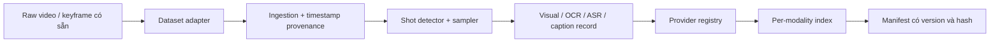
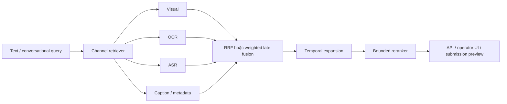

# 01 — Kiến trúc hệ thống

## Offline pipeline

## Online pipeline mục tiêu

## Trạng thái kết nối thực tế

`RetrievalService` hiện embed query và search trực tiếp trên một visual index.
`RetrievalOrchestrator`, fusion, temporal expansion và reranker đã có module và
test, nhưng chưa được nối hoàn toàn vào service đang serve API/UI.

## Ranh giới module

| Module | Trách nhiệm | Role phù hợp |
|---|---|---|
| `ingestion/` | dataset, timestamp, shot | Data engineer |
| `embedding/`, `features/` | model và modality adapter | Multimodal ML engineer |
| `indexing/`, `retrieval/` | index, fusion, temporal, rerank | Retrieval engineer |
| `api/`, `ui/` | giao diện operator và future agent | Backend/frontend engineer |
| `benchmark/`, `evaluation/` | metric, frozen run, regression | Evaluation/QA engineer |

Optional model phải lazy-load. Đường chạy offline bắt buộc không được phụ thuộc
weights hoặc network.
