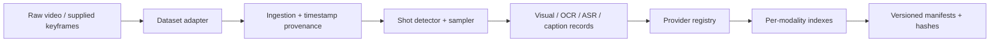
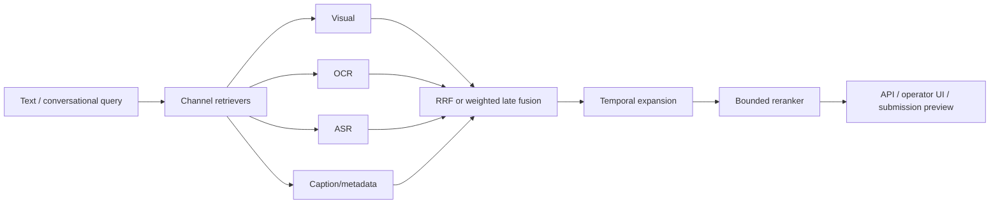
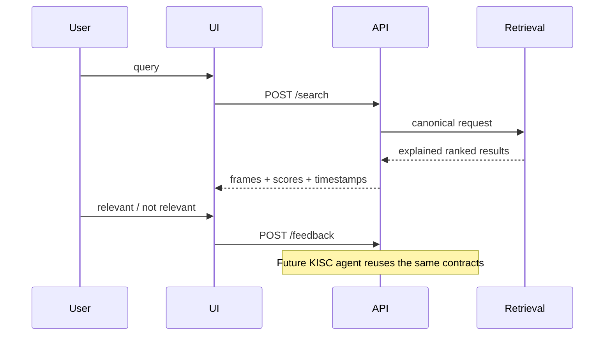

# 01 — Kiến trúc

## Offline

## Online

## Interactive and future agent

## Boundaries and ownership

| Module | Responsibility | Suggested role |
|---|---|---|
| `ingestion/` | dataset, timestamps, shots | Data/ingestion engineer |
| `embedding/`, `features/` | model and modality adapters | Multimodal ML engineer |
| `indexing/`, `retrieval/` | indexes, fusion, temporal, rerank | Retrieval engineer |
| `api/`, `ui/` | operator and future-agent interface | Backend/frontend engineer |
| `benchmark/`, `evaluation/` | metrics, frozen runs, regression | Evaluation/QA engineer |

Dependencies point inward through contracts. Optional model imports are lazy;
the mandatory offline path never needs weights or network.
